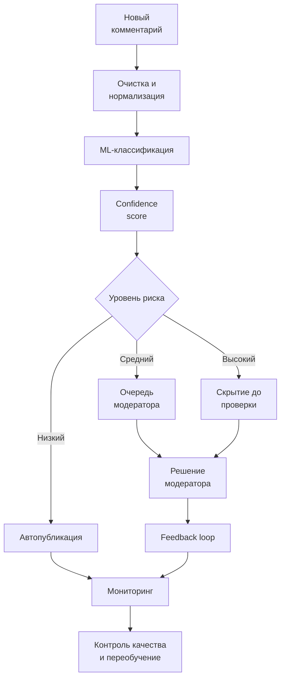

# Бизнес-процесс после внедрения ML-системы

[Вернуться к мастер-документу](../docs/MLSD_Master_Document.md)

Новый процесс обеспечивает проверку всего потока, быстрый ответ на опасный контент и накопление обратной связи для улучшения модели.
