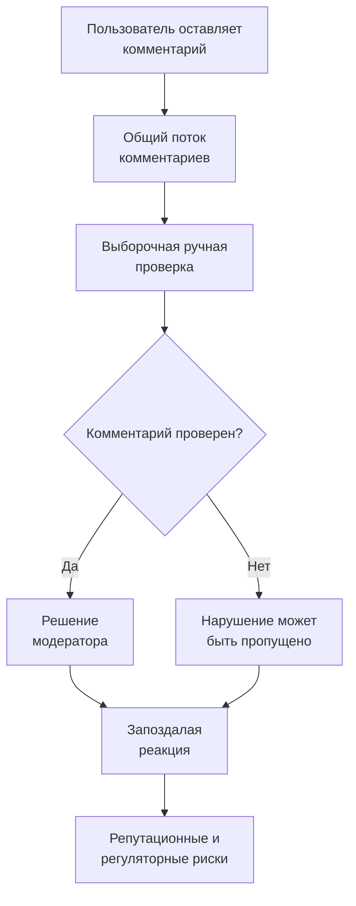

# Бизнес-процесс до внедрения ML-системы

[Вернуться к мастер-документу](../docs/MLSD_Master_Document.md)

В ручном процессе проверяется только часть потока, а качество зависит от опыта и загрузки модератора. Нарушения обнаруживаются с задержкой, при этом решения и их причины не всегда доступны для аудита.
