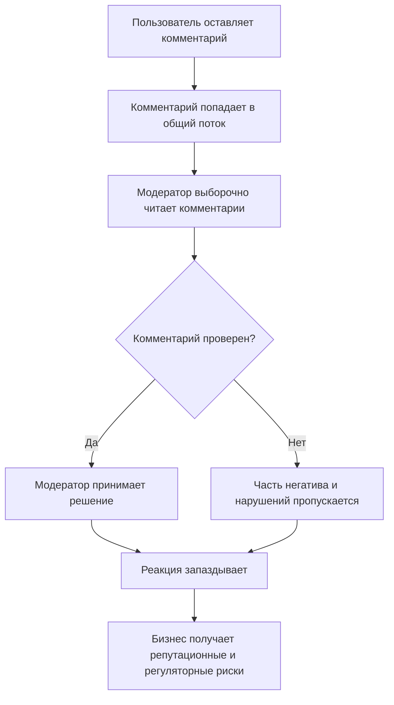

# Бизнес-процесс до внедрения ML-системы

[Вернуться к мастер-документу](../docs/MLSD_Master_Document.md)

Основные проблемы процесса:

- проверяется только часть потока;
- качество зависит от опыта и загрузки модератора;
- нарушения обнаруживаются с задержкой;
- решения и причины решений не всегда доступны для аудита.

