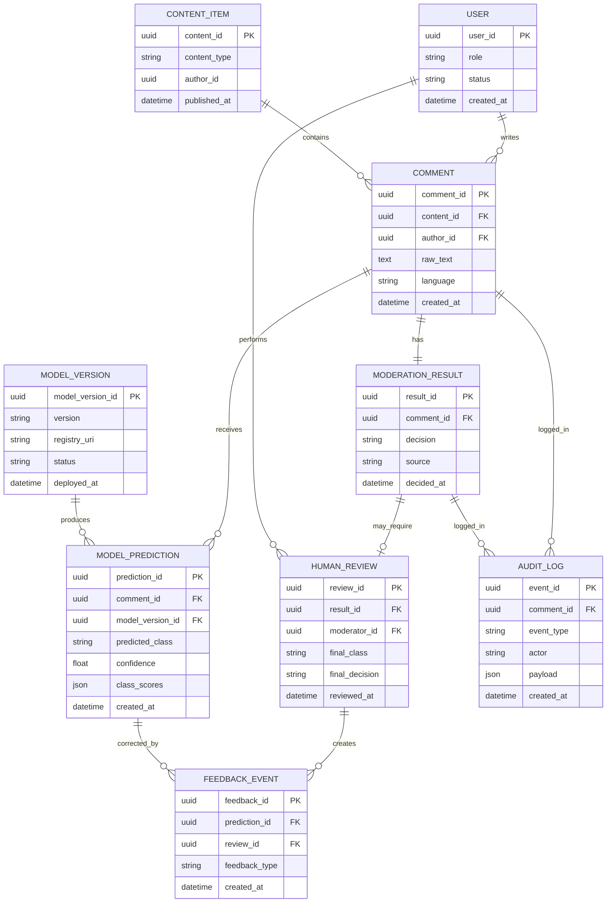

# ER-диаграмма структуры данных

[Вернуться к мастер-документу](../docs/MLSD_Master_Document.md)

```mermaid
erDiagram
    USER ||--o{ COMMENT : writes
    CONTENT_ITEM ||--o{ COMMENT : contains
    COMMENT ||--o{ MODEL_PREDICTION : receives
    MODEL_VERSION ||--o{ MODEL_PREDICTION : produces
    COMMENT ||--|| MODERATION_RESULT : has
    MODERATION_RESULT ||--o| HUMAN_REVIEW : may_require
    USER ||--o{ HUMAN_REVIEW : performs
    HUMAN_REVIEW ||--o{ FEEDBACK_EVENT : creates
    MODEL_PREDICTION ||--o{ FEEDBACK_EVENT : corrected_by
    COMMENT ||--o{ AUDIT_LOG : logged_in
    MODERATION_RESULT ||--o{ AUDIT_LOG : logged_in

    USER {
        uuid user_id PK
        string role
        string status
        datetime created_at
    }
    CONTENT_ITEM {
        uuid content_id PK
        string content_type
        uuid author_id
        datetime published_at
    }
    COMMENT {
        uuid comment_id PK
        uuid content_id FK
        uuid author_id FK
        text raw_text
        string language
        datetime created_at
    }
    MODEL_PREDICTION {
        uuid prediction_id PK
        uuid comment_id FK
        uuid model_version_id FK
        string predicted_class
        float confidence
        json class_scores
        datetime created_at
    }
    MODERATION_RESULT {
        uuid result_id PK
        uuid comment_id FK
        string decision
        string source
        datetime decided_at
    }
    HUMAN_REVIEW {
        uuid review_id PK
        uuid result_id FK
        uuid moderator_id FK
        string final_class
        string final_decision
        datetime reviewed_at
    }
    MODEL_VERSION {
        uuid model_version_id PK
        string version
        string registry_uri
        string status
        datetime deployed_at
    }
    FEEDBACK_EVENT {
        uuid feedback_id PK
        uuid prediction_id FK
        uuid review_id FK
        string feedback_type
        datetime created_at
    }
    AUDIT_LOG {
        uuid event_id PK
        uuid comment_id FK
        string event_type
        string actor
        json payload
        datetime created_at
    }
```

