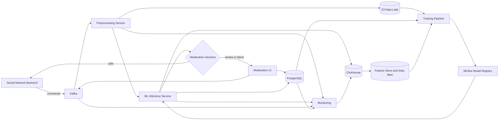

# Архитектура production-системы

[Вернуться к мастер-документу](../docs/MLSD_Master_Document.md)

Разделение online-контура, аналитического хранения и контура обучения позволяет независимо масштабировать обработку комментариев, аналитику и переобучение.
