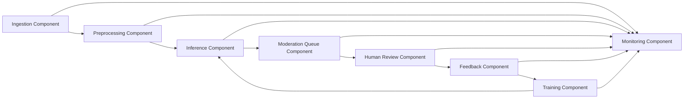

# UML-диаграмма компонентов

[Вернуться к мастер-документу](../docs/MLSD_Master_Document.md)

| Компонент | Ответственность |
|---|---|
| Ingestion Component | Прием комментариев и публикация событий |
| Preprocessing Component | Нормализация, дедупликация и определение языка |
| Inference Component | Классификация и расчет confidence score |
| Moderation Queue Component | Приоритизация спорных и опасных комментариев |
| Human Review Component | Рабочее место модератора и фиксация решения |
| Feedback Component | Сбор исправлений и оценка качества |
| Monitoring Component | Технические и ML-метрики, алерты |
| Training Component | Подготовка выборки, обучение и регистрация модели |

