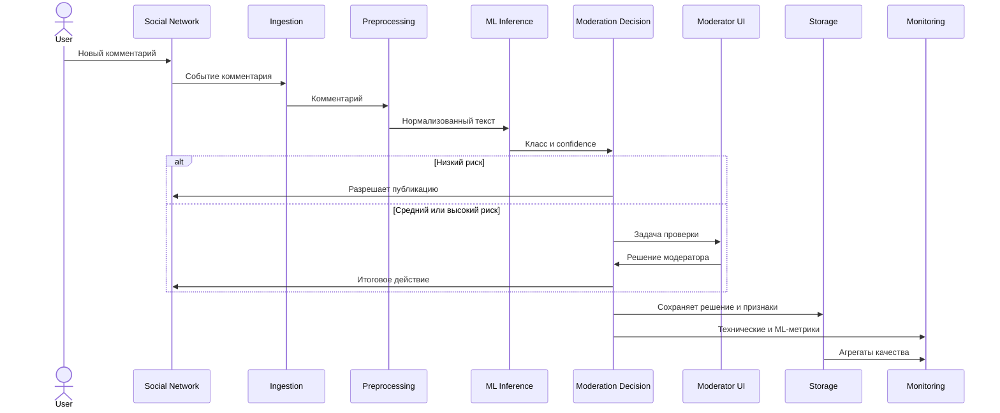

# UML-диаграмма последовательности

[Вернуться к мастер-документу](../docs/MLSD_Master_Document.md)

```mermaid
sequenceDiagram
    actor User
    participant SN as Social Network
    participant ING as Ingestion
    participant PRE as Preprocessing
    participant ML as ML Inference
    participant DEC as Moderation Decision
    participant UI as Moderator UI
    participant ST as Storage
    participant MON as Monitoring

    User->>SN: Новый комментарий
    SN->>ING: Событие комментария
    ING->>PRE: Комментарий
    PRE->>ML: Нормализованный текст
    ML->>DEC: Класс и confidence
    alt Низкий риск
        DEC->>SN: Разрешает публикацию
    else Средний или высокий риск
        DEC->>UI: Задача проверки
        UI->>DEC: Решение модератора
        DEC->>SN: Итоговое действие
    end
    DEC->>ST: Сохраняет решение и признаки
    DEC->>MON: Технические и ML-метрики
    ST->>MON: Агрегаты качества
```
