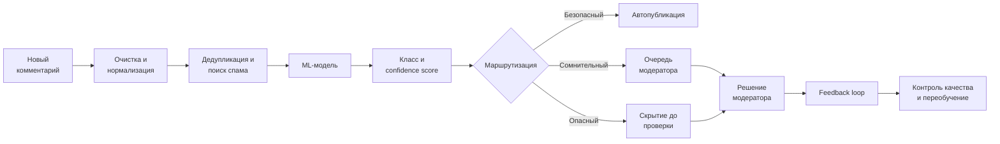

# Кейс: ML-система для автоматического мониторинга пользовательских реакций

## Состав команды

- `Прель Александр` - Product Owner, Data Analyst
- `Скоблилова Виктория` - Data Scientist, ML Engineer
- `Биктагирова Зарина` - Software Architect, Data Engineer

## Оглавление

- [1. Цели и предпосылки](#1-цели-и-предпосылки)
- [2. Методология](#2-методология)
- [3. Подготовка пилота](#3-подготовка-пилота)
- [4. Внедрение production-системы](#4-внедрение-production-системы)
- [5. Как система меняет бизнес-процесс](#5-как-система-меняет-бизнес-процесс)
- [6. Критерии готовности релиза](#6-критерии-готовности-релиза)
- [7. Технический долг после MVP](#7-технический-долг-после-mvp)
- [8. Краткий сценарий защиты на 5 минут](#8-краткий-сценарий-защиты-на-5-минут)
- [9. Связанные диаграммы](#9-связанные-диаграммы)

## 1. Цели и предпосылки

### 1.1. Зачем идем в разработку продукта

Социальная сеть получает до 500 000 комментариев в день. Ручная выборочная проверка не покрывает весь поток, зависит от опыта модератора и приводит к задержкам. Неприемлемый контент может оставаться доступным пользователям, снижать вовлеченность, вредить репутации и приводить к штрафам по результатам внешнего контроля.

Цель продукта - автоматически оценивать каждый комментарий, быстро обрабатывать очевидные случаи и направлять модераторам только комментарии, требующие экспертного решения.

После пилота система должна снизить ручную нагрузку на модераторов не менее чем на 50 процентов и сократить медианное время реакции на опасный комментарий до 1 минуты. Дополнительный эффект состоит в снижении доли пропущенного запрещенного контента, повышении стабильности решений и получении аналитики о реакции аудитории на публикации.

### 1.2. Бизнес-требования и ограничения

| Область | Требование |
|---|---|
| Покрытие | Обрабатывать до 500 000 новых комментариев в сутки |
| Классы | Определять positive, neutral, negative, toxic, prohibited_content, spam, need_human_review |
| Решение | Автоматически публиковать безопасные, направлять спорные модератору, скрывать опасные до проверки |
| Скорость | Online inference не более 500 мс на комментарий на уровне p95 |
| Доступность | Production API не ниже 99,5 процента в месяц |
| Аудит | Сохранять версию модели, оценки классов, итоговое решение и историю пересмотра |
| Контроль | Предоставлять возможность ручного пересмотра любого решения |
| Данные | Соблюдать требования по защите персональных данных и срокам хранения |
| Язык MVP | Русскоязычные текстовые комментарии |

Ключевые ограничения связаны с качеством данных и характером потока. Историческая разметка может быть неполной и несогласованной, а классы `toxic` и `prohibited_content` встречаются редко, хотя именно для них требуется высокая полнота. Правила запрещенного контента со временем меняются, а пиковая нагрузка может значительно превышать среднесуточную. В неоднозначных и юридически значимых случаях окончательное решение всегда принимает модератор.

### 1.3. Что входит в скоуп MVP, а что не входит

MVP охватывает прием русскоязычных текстовых комментариев, их очистку, нормализацию, дедупликацию и базовое выявление спама. Система выполняет многоклассовую классификацию, рассчитывает confidence score, маршрутизирует комментарии по порогам риска и передает спорные случаи в очередь модерации. Решения и обратная связь сохраняются для аудита, мониторинга качества и пакетного переобучения модели.

За границами MVP остаются анализ изображений, видео, аудио и личных сообщений, автоматические санкции к аккаунтам, персонализация решений, полноценная поддержка других языков и генерация ответов пользователям.

### 1.4. Предпосылки решения

Решение предполагает, что Social Network Backend способен публиковать события о новых комментариях, а исторические комментарии и решения модераторов доступны минимум за 6 месяцев. Каждый комментарий должен иметь стабильный идентификатор, время создания и связь с объектом контента. Эксперты по политике модерации готовят руководство по разметке, а выделенная группа модераторов проверяет сложные случаи и контрольную выборку во время пилота. Базовая инфраструктура поддерживает Docker, Kubernetes, Kafka, S3-совместимое хранилище и PostgreSQL.

## 2. Методология

### 2.1. Постановка задачи

Основная ML-задача - многоклассовая классификация текста. Для каждого комментария модель возвращает вероятности семи классов. `positive` обозначает выраженную положительную реакцию, `neutral` - нейтральную реакцию без признаков нарушения, а `negative` - негативную реакцию, которая не нарушает правила. Класс `toxic` охватывает оскорбления, травлю и агрессивную речь, `prohibited_content` - контент, запрещенный правилами платформы или законом, `spam` - массовую рекламу и повторяющиеся нерелевантные сообщения. Класс `need_human_review` используется для неоднозначных случаев, требующих решения модератора.

Правило маршрутизации использует класс, confidence score и бизнес-пороги:

| Условие | Действие |
|---|---|
| Безопасный класс и confidence выше порога автопубликации | Опубликовать автоматически |
| Опасный класс и confidence выше порога блокировки | Скрыть до проверки модератором |
| Низкий confidence или конфликт правил | Направить модератору |

Пороги настраиваются отдельно по классам. Для `prohibited_content` приоритетом является Recall, поэтому порог отправки на проверку ниже, чем для других классов.

### 2.2. Блок-схема решения

Детальное изменение процесса показано в диаграммах [до внедрения](../diagrams/business_process_before.md) и [после внедрения](../diagrams/business_process_after.md).

### 2.3. Этапы решения задачи

Работа начинается с согласования таксономии классов, руководства по разметке и матрицы действий. Затем команда выгружает исторические комментарии, очищает данные, устраняет дубли и проверяет возможные утечки. Стратифицированную выборку независимо размечают два модератора, после чего обучается baseline и дообучается transformer-модель с подбором порогов по классам.

Перед пилотом модель проходит offline-проверку, нагрузочное тестирование и проверку безопасности. Сначала она запускается в shadow mode на 5 процентах потока без влияния на публикацию, затем участвует в пилоте на 10 процентах потока. По итогам команда анализирует метрики, корректирует пороги и принимает решение о rollout. После внедрения качество поддерживается мониторингом, feedback loop и регулярным переобучением.

### 2.4. Данные и сущности

Основные источники:

| Источник | Данные | Назначение |
|---|---|---|
| Social Network Backend | Текст, время, идентификаторы комментария и контента | Online inference |
| История модерации | Решение, причина, модератор, время проверки | Целевая переменная и аудит |
| Жалобы пользователей | Тип жалобы и подтвержденный результат | Поиск false negative |
| Словари и правила | Стоп-слова, шаблоны спама, запрещенные выражения | Признаки и rule-based проверки |
| Метрики сервиса | Latency, ошибки, пропускная способность | Технический мониторинг |

Структура сущностей и связей приведена в [ER-диаграмме](../diagrams/data_structure_er.md).

Качество входных данных контролируется по доле пустых текстов, дублей, неизвестных языков, нарушений схемы, задержке доставки и изменению распределений.

### 2.5. Формирование выборки

Выборка формируется из исторических комментариев за последние 6-12 месяцев. Разбиение выполняется по времени и пользователям, чтобы комментарии одного автора и близкие дубли не попадали одновременно в train и test.

Предлагаемое разбиение:

| Часть | Доля | Назначение |
|---|---:|---|
| Train | 70 процентов | Обучение модели |
| Validation | 15 процентов | Подбор гиперпараметров и порогов |
| Test | 15 процентов | Финальная независимая оценка |

Редкие классы `toxic` и `prohibited_content` дополнительно включаются через стратифицированную выборку из жалоб и подтвержденных нарушений. Метрики на test рассчитываются с весами, восстанавливающими реальное распределение потока. Тестовая выборка фиксируется до начала экспериментов.

Разметка выполняется по руководству двумя модераторами. Конфликты разрешает старший модератор. Для контроля согласованности измеряется Cohen's kappa, целевое значение - не ниже 0,75.

### 2.6. Целевая переменная

Целевая переменная `moderation_class` принимает один из семи классов. Источником истины служит финальное решение проверенного модератора после разрешения конфликтов.

Вместе с целевым классом сохраняются дополнительные поля: `moderation_action` определяет действие publish, review, hide или block; `is_confirmed` показывает прохождение экспертной проверки; `policy_version` фиксирует версию правил; `label_source` указывает источник метки, например ручную разметку, жалобу или историческое решение.

Класс `need_human_review` присваивается случаям, где контекст недостаточен, правила конфликтуют или модераторы не могут надежно выбрать другой класс.

### 2.7. Метрики качества ML и связь с бизнес-результатом

| Метрика | Цель пилота | Связь с бизнесом |
|---|---:|---|
| Recall для prohibited_content | не ниже 0,95 | Снижает число пропущенных нарушений и риск штрафов |
| Precision для prohibited_content | не ниже 0,75 | Ограничивает лишние блокировки и нагрузку |
| Recall для toxic | не ниже 0,90 | Сокращает время доступности токсичных сообщений |
| Macro F1-score | не ниже 0,80 | Показывает качество по всем классам, включая редкие |
| PR-AUC опасных классов | выше baseline минимум на 10 процентов | Оценивает ранжирование при дисбалансе |
| False negative prohibited_content | не выше 5 процентов | Прямой индикатор регуляторного риска |
| p95 latency inference | не выше 500 мс | Не задерживает пользовательский сценарий |
| Доля автообработки | не ниже 50 процентов | Снижает нагрузку на модераторов |

Дополнительно анализируются confusion matrix, ROC-AUC, метрики по типам контента, времени, длине текста и группам риска. Бизнес-метрики сравниваются с ручной модерацией: трудозатраты, время реакции, подтвержденные пропуски, жалобы и вовлеченность.

### 2.8. Бейзлайн и MVP-модель

Baseline состоит из TF-IDF признаков по словам и символам, логистической регрессии и набора правил для очевидного спама и запрещенных выражений. Он быстро обучается, интерпретируем и задает минимальный уровень качества.

MVP-модель - дообученный ruBERT или сопоставимый русскоязычный transformer. На выходе используется softmax по семи классам с последующей калибровкой вероятностей. Порог каждого класса подбирается на validation с учетом стоимости false positive и false negative.

При выборе модели baseline и transformer сравниваются на фиксированном test. Помимо общего качества проверяются редкие классы и новые временные периоды, измеряются latency и стоимость inference. После анализа ошибок с модераторами одобренная модель и ее пороги регистрируются в MLflow Model Registry.

### 2.9. Риски анализа и моделирования

| Риск | Влияние | Мера снижения |
|---|---|---|
| Дисбаланс классов | Низкая полнота редких нарушений | Стратификация, веса классов, hard negative mining |
| Ошибки исторической разметки | Модель повторяет неверные решения | Повторная разметка и контроль согласованности |
| Утечка дублей | Завышенная offline-оценка | Дедупликация до разбиения |
| Изменение языка и спам-шаблонов | Деградация после запуска | Drift-мониторинг и регулярное переобучение |
| Сарказм и контекст | Ложные решения | Маршрутизация низкого confidence модератору |
| Смещение по группам пользователей | Неравномерное качество | Срезы качества и экспертный аудит |
| Некалиброванный confidence | Ошибочная автомаршрутизация | Калибровка вероятностей и контроль порогов |

## 3. Подготовка пилота

### 3.1. Способ оценки пилота

Пилот проходит в два этапа. В течение первых 7 дней используется shadow mode на 5 процентах потока: модель формирует решения, но не влияет на публикацию, а результаты сравниваются с ручной модерацией. Затем проводится контролируемый A/B-тест на 10 процентах потока в течение 14 дней. В тестовой группе ML-система автоматически публикует безопасные комментарии и создает приоритетную очередь для остальных, а в контрольной группе продолжает действовать текущий процесс.

Все опасные решения и случайная выборка не менее 5 процентов безопасных решений проверяются модераторами. Метрики считаются с доверительными интервалами и отдельно по классам.

### 3.2. Что считаем успешным пилотом

Пилот считается успешным, если Recall для `prohibited_content` достигает 0,95, Recall для `toxic` - 0,90, а Precision для `prohibited_content` - 0,75. Система должна автоматически обрабатывать не менее 50 процентов комментариев, сократить медианное время реакции минимум на 50 процентов и снизить ручную нагрузку минимум на 30 процентов без роста подтвержденных пропусков. При этом p95 latency не должен превышать 500 мс, доступность должна составлять не менее 99,5 процента, а критические инциденты безопасности и необратимые ошибочные блокировки недопустимы.

### 3.3. Подготовка пилота

До запуска необходимо утвердить политику классов и пороги маршрутизации, подготовить контрольную выборку и назначить модераторов. Техническая подготовка включает интеграцию ingestion, inference, очереди и интерфейса модератора, настройку дашбордов качества, нагрузки и ошибок, а также нагрузочное тестирование на двукратном ожидаемом пике. Команда отдельно проверяет откат на ручную модерацию, проводит инструктаж модераторов и службы поддержки, назначает владельцев инцидентов и фиксирует критерии остановки пилота.

Критерии немедленной остановки: недоступность более 15 минут, рост false negative запрещенного контента выше контрольной группы, утечка данных или массовая ошибочная блокировка.

## 4. Внедрение production-системы

### 4.1. Архитектура решения

Система использует событийную микросервисную архитектуру. Social Network Backend передает комментарии в Comment Ingestion Service, который публикует события в Kafka. Preprocessing Service нормализует текст и формирует признаки. ML Inference Service получает активную модель из MLflow, возвращает вероятности классов и создает решение маршрутизации.

Moderation Queue хранит приоритетные задачи. Human Review Interface позволяет модератору принять решение, а Feedback Loop передает исправления в контур качества и обучения. PostgreSQL хранит метаданные и результаты, S3 Data Lake - сырые и подготовленные датасеты, ClickHouse - логи и агрегаты, Feature Store и Data Mart - воспроизводимые признаки и аналитические витрины. Monitoring Service отслеживает технические и ML-метрики. Training Pipeline обучает модели и публикует одобренные версии в Model Registry.

Подробности приведены в [архитектурной диаграмме](../diagrams/system_architecture.md), [диаграмме компонентов](../diagrams/uml_components.md) и [диаграмме последовательности](../diagrams/uml_sequence.md).

### 4.2. Инфраструктура и масштабируемость

| Компонент | Технология | Масштабирование и отказоустойчивость |
|---|---|---|
| Сервисы | Docker, Kubernetes | Горизонтальное по CPU, RPS и Kafka lag |
| Очередь | Kafka | Партиции, репликация, consumer groups |
| Метаданные | PostgreSQL | Реплика, резервное копирование, point-in-time recovery |
| Сырые данные | S3-совместимое хранилище | Версионирование и lifecycle policy |
| Аналитика | ClickHouse | Репликация и партиционирование по дате |
| Признаки и витрины | Feature Store и Data Mart | Версии признаков и воспроизводимость выборок |
| Модели | MLflow Model Registry | Версии, стадии и быстрый rollback |
| Мониторинг | Prometheus, Grafana | Алерты по SLA, ресурсам и качеству |

При среднем потоке около 5,8 комментария в секунду инфраструктура проектируется на кратковременный пик 100 RPS. Kafka сглаживает всплески. ML Inference Service масштабируется независимо и использует пакетирование только там, где оно не нарушает latency.

### 4.3. Требования к работе системы: SLA, RPS, Latency

| Показатель | Требование |
|---|---:|
| Объем | 500 000 комментариев в сутки |
| Проектный пиковый поток | 100 RPS |
| Доступность production API | не ниже 99,5 процента в месяц |
| p95 end-to-end latency | не выше 500 мс |
| p99 end-to-end latency | не выше 1 секунды |
| Максимальная задержка очереди при штатной работе | не выше 30 секунд |
| Потеря подтвержденных событий | 0 |
| RPO для результатов модерации | не выше 5 минут |
| RTO критичных сервисов | не выше 30 минут |

При недоступности ML Inference Service события сохраняются в Kafka, а Social Network Backend применяет согласованный fallback: передает комментарии в ручную очередь или временно использует правила.

### 4.4. Безопасность системы

Сервисы аутентифицируются с помощью короткоживущих учетных данных, а пользователи получают доступ по ролям и принципу минимальных привилегий. Сетевой обмен защищается TLS, секреты хранятся отдельно от образов и репозитория, а сетевые маршруты между сервисами ограничиваются. Система ведет аудит входов и изменений решений, моделей и порогов, выполняет сканирование контейнеров и зависимостей, валидирует входные данные и применяет rate limiting. Резервные копии создаются регулярно, а возможность восстановления периодически проверяется.

### 4.5. Безопасность данных

Текст комментария и идентификаторы рассматриваются как потенциально персональные данные. Система минимизирует набор сохраняемых полей, разделяет идентификаторы и тексты, шифрует данные при передаче и хранении.

Доступ к сырым данным предоставляется только ролям, которым он необходим. Аналитические наборы используют псевдонимизированные идентификаторы. Для каждого слоя задаются срок хранения, основание обработки и процесс удаления. Выгрузки для обучения регистрируются и воспроизводимы. Действия модераторов и операторов записываются в неизменяемый аудит.

### 4.6. Издержки

Основные статьи затрат:

| Статья | Драйвер стоимости | Способ контроля |
|---|---|---|
| Inference | Число комментариев и размер модели | Квантование, autoscaling, оптимизация runtime |
| Хранение | Сырые тексты, логи и версии датасетов | Lifecycle policy и агрегация старых логов |
| Разметка | Число экспертных проверок | Active learning и приоритет сложных случаев |
| Модерация | Доля комментариев в ручной очереди | Калибровка порогов без снижения Recall |
| Обучение | Частота и объем переобучения | Запуск по сигналу drift или расписанию |
| Поддержка | Инциденты и эксплуатация | Наблюдаемость, runbook и автоматический rollback |

Стоимость оценивается до пилота нагрузочными тестами и пересчитывается после получения фактической доли автообработки.

### 4.7. Integration points

| Интеграция | Контракт | Назначение |
|---|---|---|
| Social Network Backend | Kafka event и REST callback | Прием комментариев и применение решения |
| Identity and Access Management | OIDC и RBAC | Доступ модераторов и операторов |
| Moderation UI | REST API и WebSocket | Очередь, решение и обновление статуса |
| Data Lake | S3 API | Хранение датасетов и артефактов |
| Model Registry | MLflow API | Получение и регистрация версий моделей |
| Monitoring | Prometheus metrics и structured logs | Дашборды и алерты |
| Notification Service | Webhook | Оповещения об инцидентах и росте очереди |

Контракты версионируются. Каждое событие содержит `event_id`, `comment_id`, время, версию схемы и correlation ID. Обработчики идемпотентны.

### 4.8. Риски и неопределенности

| Риск | Последствие | План реагирования |
|---|---|---|
| Резкий рост потока | Рост latency и очереди | Autoscaling, запас партиций, деградационный режим |
| Недоступность модели | Остановка автомодерации | Предыдущая версия модели и ручной fallback |
| Ошибочный rollout | Массовые неверные решения | Canary, shadow mode, быстрый rollback |
| Drift данных | Снижение качества | Алерты, экспертная выборка, переобучение |
| Изменение правил | Несоответствие решений политике | Версионирование policy и срочная смена порогов |
| Компрометация данных | Регуляторный и репутационный ущерб | Шифрование, RBAC, аудит, incident response |
| Перегрузка модераторов | Рост времени проверки | Приоритизация, лимиты автопубликации, перераспределение |

## 5. Как система меняет бизнес-процесс

До внедрения модераторы выборочно читают общий поток. Часть нарушений не проверяется, решения принимаются с задержкой, а качество сложно измерить.

После внедрения каждый комментарий проходит автоматическую оценку. Безопасные комментарии публикуются без задержки, опасные скрываются до проверки, спорные попадают в приоритетную очередь. Модераторы концентрируются на сложных случаях, а их решения возвращаются в feedback loop.

| Параметр | До внедрения | После внедрения |
|---|---|---|
| Покрытие потока | Выборочное | Полное автоматическое |
| Скорость первичной оценки | Минуты или часы | До 500 мс на p95 |
| Роль модератора | Чтение общего потока | Проверка сложных и опасных случаев |
| Контроль качества | Периодические проверки | Постоянные метрики и аудит |
| Улучшение процесса | Ручное изменение инструкций | Feedback loop и переобучение |

Подробные схемы: [процесс до внедрения](../diagrams/business_process_before.md) и [процесс после внедрения](../diagrams/business_process_after.md).

## 6. Критерии готовности релиза

Релиз готов к запуску после выполнения критериев успешного пилота и одобрения порогов бизнес-владельцем и владельцем политики модерации. Модель, датасет, код и параметры должны иметь версии, а функциональные, интеграционные и нагрузочные тесты должны быть пройдены. SLA подтверждается на двукратной пиковой нагрузке, дополнительно проверяются fallback, canary rollout, rollback, безопасность и восстановление данных.

До выхода в production дашборды и алерты должны покрывать сервисные и ML-метрики. Команда готовит runbook, схему эскалации и список ответственных, обучает модераторов работе с очередью и пересмотром решений, а также настраивает аудит, feedback loop и расписание контроля качества.

## 7. Технический долг после MVP

| Задача | Причина переноса | Приоритет |
|---|---|---|
| Мультиязычная классификация | MVP ограничен русским языком | Высокий |
| Учет контекста ветки обсуждения | Требует отдельной модели и хранения контекста | Высокий |
| Анализ изображений и видео | Требует мультимодального контура | Средний |
| Автоматизированный active learning | На MVP выборку формирует аналитик | Средний |
| Объяснение решений модератору | Требует оценки полезности и рисков | Средний |
| Оптимизация transformer runtime | Выполняется после измерения production-нагрузки | Средний |
| Автоматический поиск fairness-проблем | На MVP выполняется периодический ручной аудит | Средний |

## 8. Краткий сценарий защиты на 5 минут

**0:00-0:40 - Проблема.** Социальная сеть получает до 500 000 комментариев в день. Ручная выборочная модерация медленная, дорогая и пропускает нарушения, что создает риск штрафов и снижает качество пользовательского опыта.

**0:40-1:20 - Цель и решение.** Система классифицирует каждый комментарий по семи классам, вычисляет confidence score и выбирает действие: безопасное публикует, спорное направляет модератору, опасное скрывает до проверки.

**1:20-2:10 - ML-часть.** Baseline строится на TF-IDF и логистической регрессии. MVP использует ruBERT. Ключевые метрики - Recall и Precision опасных классов, Macro F1, PR-AUC, false negative и доля автообработки.

**2:10-3:10 - Архитектура.** События поступают через Kafka, preprocessing и inference работают в Kubernetes. PostgreSQL хранит решения, S3 - датасеты, ClickHouse - аналитику, MLflow - версии моделей, Prometheus и Grafana - мониторинг.

**3:10-4:10 - Пилот.** Сначала запускается shadow mode на 5 процентах потока, затем A/B-тест на 10 процентах. Опасные и сложные случаи обязательно проверяют модераторы. Успех требует Recall prohibited_content не ниже 0,95 и автообработку не ниже 50 процентов.

**4:10-5:00 - Эффект и контроль рисков.** Решение снижает ручную нагрузку и время реакции, сохраняет полный аудит и использует feedback loop. Canary rollout, fallback на ручную очередь, drift-мониторинг и быстрый rollback ограничивают риски production-запуска.

## 9. Связанные диаграммы

- [Бизнес-процесс до внедрения](../diagrams/business_process_before.md)
- [Бизнес-процесс после внедрения](../diagrams/business_process_after.md)
- [ER-диаграмма структуры данных](../diagrams/data_structure_er.md)
- [Архитектура production-системы](../diagrams/system_architecture.md)
- [UML-диаграмма компонентов](../diagrams/uml_components.md)
- [UML-диаграмма последовательности](../diagrams/uml_sequence.md)
